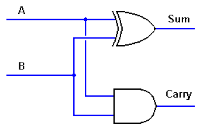
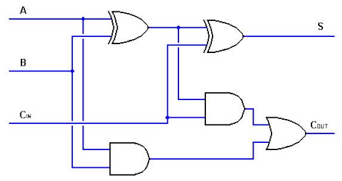

# HAdder_FAdder_in_SystemC - vincent08tw
###### tags: `SystemC`

## Project Description
Implement a half-adder and a full adder in SystemC.

* Environment
	* SystemC 2.3.3
	* Ubuntu 18.04

* Specification  
	* A half-adder schematic
		
	* A full-adder schematic
		
```
half-adder module
1. Use above schematic as the specification and implement a SC_MODULE with a SC_METHOD process

full-adder module
1. Use above schematic as the specification and implement a SC_MODULE with a SC_METHOD process

sc_main
1. Instantiate both half-adder and full-adder modules
2. Provide all possible combinations to these modules
```

## Project directory hierachy
```
HAdder_FAdder_in_SystemC/
    +-- src/
    |   +-- FullAdder.cpp
    |   +-- FullAdder.h
    |   +-- HalfAdder.cpp
    |   +-- HalfAdder.h
    |   +-- main.cpp
    |   +-- Makefile
    |
	+-- result/
	|   +-- RESULT.vcd
	+-- img/
	|   FAdder_schematic.PNG
	|   HAdder_schematic.PNG
	|
	README.md
```


